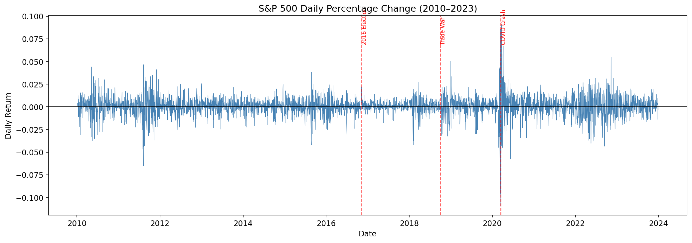

# Do Words Move Markets?

**NLP Analysis of Public Figure Tweets and S&P 500 Reactions (2010–2023)**

A systematic test of whether language from Donald Trump, Elon Musk, and U.S. presidential speeches can predict S&P 500 direction or volatility. Across 59,627 records and five classifiers, text features fail to beat a momentum baseline for direction prediction. A non-linear model (MLP) does achieve **AUC = 0.565** for next-day volatility events, and a reverse-causality test shows the tweet-market relationship is **bidirectional**.

> **TL;DR:** Language doesn't tell you *which way* the market will move (consistent with semi-strong-form Efficient Market Hypothesis), but it does carry signal about *how much* it will move. That makes public-figure text more useful as a volatility-monitoring input than a directional trading signal.


---

## Why this project

In December 2016, a single Trump tweet criticizing Boeing's Air Force One contract briefly wiped roughly a billion dollars off the company's market cap before markets had even opened. Anecdotes like that raise an obvious question: if one tweet can move a single stock, can systematic patterns in public-figure language predict broad market moves at scale? This project tests that hypothesis rigorously, using 13 years of tweets and speeches against S&P 500 returns, and treats "no signal" as a finding worth quantifying.

---

## Headline findings

| # | Finding | Evidence |
|---|---|---|
| 1 | Tweet text does **not** reliably predict S&P 500 direction | No model beats the momentum baseline (F1 = 0.503) across 5 classifiers × 3 lag windows × walk-forward CV |
| 2 | Tweet text **weakly predicts next-day volatility events** (\|return\| > 0.5%) | MLP AUC = 0.565; signal driven by capitalization intensity, exclamation frequency, and macro vocabulary ("tariff", "china", "trade") |
| 3 | The relationship is **bidirectional**: markets also predict subsequent tweet sentiment | Reverse-causality test: r = +0.040, p = 0.046 |

---

## Tech stack

`Python` `pandas` `scikit-learn` `spaCy` `NLTK` `Gensim LDA` `VADER` `TextBlob` `yfinance` `kagglehub` `matplotlib` `seaborn` `pyLDAvis`

---

## Repo structure

```
.
├── notebooks/
│   ├── 01_data_preparation.ipynb    # ETL: 4 sources to 5 cleaned CSVs to merged dataset
│   └── 02_full_analysis.ipynb       # Full NLP pipeline: EDA, TF-IDF, NER, sentiment, LDA, modeling
├── data/cleaned/                    # Cleaned CSVs (regenerate via notebook 01)
├── figures/                         # Saved hero charts and pyLDAvis screenshots
├── requirements.txt
├── LICENSE
└── README.md
```

---

## How to run

```bash
# 1. Clone
git clone https://github.com/<your-username>/do-words-move-markets.git
cd do-words-move-markets

# 2. Install
pip install -r requirements.txt
python -m spacy download en_core_web_sm
python -m nltk.downloader punkt punkt_tab stopwords wordnet

# 3. (One-time) Set Kaggle credentials
export KAGGLE_USERNAME=<your-username>
export KAGGLE_KEY=<your-key>

# 4. Run notebooks in order
jupyter notebook notebooks/01_data_preparation.ipynb
jupyter notebook notebooks/02_full_analysis.ipynb
```

Set `ECLIPSE_DATA_DIR` if you want CSVs saved somewhere other than `./data/cleaned/`.

---

## Dataset

| Source | Records | Time span |
|---|---|---|
| Donald Trump tweets (Kaggle) | 56,571 | May 2009 – Jan 2021 |
| Elon Musk tweets (Kaggle) | 24,450 | Jun 2010 – Jun 2023 |
| U.S. presidential speeches (Kaggle) | 995 | 2010–2020 subset used |
| SPY ETF daily returns (Yahoo Finance) | 3,521 trading days | 2010–2023 |
| **Final merged dataset** | **59,627 rows × 5 cols** | 2010–2023 |

---

## Methods summary

The analysis runs in six stages, each adding a different layer of signal:

1. **Data preparation.** `pandas` ETL, date harmonization, inner join of the text corpus with daily S&P 500 returns.
2. **Descriptive text analysis.** Word frequency, n-grams, TF-IDF; per-speaker linguistic fingerprints; Zipf's-law verification.
3. **Linguistic features.** `spaCy` POS tagging and Named Entity Recognition (121,589 PERSON/ORG/GPE mentions extracted in a single batched pass).
4. **Semantic analysis.** VADER sentiment scoring plus Gensim LDA topic modeling with coherence-optimized k (c_v sweep, k = 3 to 10), run separately on each speaker corpus and on crash-vs-boost return regimes.
5. **Predictive modeling.** Logistic Regression, Linear SVM, MLP, and Gradient Boosting on a hybrid feature matrix (2,500 TF-IDF unigram/bigram features plus sentiment, lexical, and temporal metadata).
6. **Validation and robustness.** Chronological 80/20 split (Jan 2019 cutoff), 5-fold walk-forward `TimeSeriesSplit` CV, train-only TF-IDF fitting, single-speaker restriction to handle the Twitter ban domain shift.

### Key methodological choices

- **Single-speaker restriction.** Trump's 2021 Twitter ban means his tweets all fall before any reasonable train/test cutoff, while Musk's span both periods. A naive time-based split would train on one speaker and test on another (cross-speaker domain shift). The analysis is restricted to Trump's pre-ban tweets (42,762 records, 2010–2020) so model performance reflects temporal generalization, not stylistic differences between speakers.
- **Walk-forward CV.** Standard k-fold would allow future data to leak into training. `TimeSeriesSplit` (5 folds, expanding training window) is used throughout.
- **Reverse-causality test.** Pearson and Spearman correlations between yesterday's return and today's tweet sentiment establish that the tweet-market relationship is bidirectional, which complicates any naive causal interpretation of forward associations.
- **Volatility as alternative target.** When direction prediction failed, the analysis reframed the question to volatility events (|next-day return| > 0.5%), where non-linear models (MLP, GBT) found a measurable signal that linear models did not.

---

## Selected results

### Direction prediction (5-fold walk-forward CV, Lag-1)

| Model | F1-weighted (mean ± std) | AUC |
|---|---|---|
| Momentum baseline | 0.503 | 0.487 |
| SVM (TF-IDF) | 0.506 ± 0.019 | 0.493 ± 0.006 |
| MLP (TF-IDF + meta) | 0.502 ± 0.014 | 0.499 ± 0.010 |
| LR (TF-IDF) | 0.499 ± 0.030 | 0.493 ± 0.007 |
| Gradient Boosting | 0.456 ± 0.052 | 0.477 ± 0.030 |

**No model beats the momentum baseline.** This is consistent with the semi-strong form of the Efficient Market Hypothesis.

### Volatility-event prediction (target: |next-day return| > 0.5%)

| Model | F1-weighted | AUC-ROC | Δ vs. Direction AUC |
|---|---|---|---|
| **MLP (all features)** | **0.496** | **0.565** | **+0.066** |
| GBT (all features) | 0.493 | 0.535 | +0.051 |
| SVM (TF-IDF) | 0.446 | 0.492 | −0.001 |
| LR (TF-IDF) | 0.423 | 0.493 | 0.000 |

**Non-linear models find a meaningful signal that linear models miss.** Top features: capitalization ratio, exclamation count, and economy-related vocabulary.

### Reverse-causality check

| Direction tested | Pearson r | p-value |
|---|---|---|
| Yesterday's return → today's tweet sentiment | **+0.040** | **0.046** ✓ |
| Yesterday's return → today's tweet volume | −0.008 | 0.674 |
| Yesterday's return → today's exclamation count | +0.010 | 0.617 |

**Markets predict subsequent tweet sentiment** with a small but statistically significant effect. The relationship is bidirectional.

---

## Limitations and future work

- **Daily granularity** maps multiple tweets to the same closing return regardless of intraday timing. Intraday timestamp matching to minute-level prices would improve causal attribution.
- **Volatility distributional shift.** The test period (2019–2020) had a 59.2% volatility event rate vs. 44.4% in training, driven by the trade war and COVID-19. AUC is less sensitive to this than accuracy, but a stable-volatility test period would strengthen the result.
- **General-purpose sentiment.** VADER and TextBlob are not calibrated for financial language. **FinBERT** or the **Loughran-McDonald** lexicon are natural next steps.
- **Single speaker** in the predictive stage means results may not generalize to Fed chairs, Treasury secretaries, or major CEOs. A multi-speaker design with **Granger causality testing** would directly address this.

---

## What I'd do differently

If I extended this project, I'd swap VADER for FinBERT to better capture finance-specific tone and add intraday timestamp matching to minute-level prices so same-day effects can be isolated cleanly from next-day ones. I'd also expand beyond a single speaker, ideally with a Granger causality framework, to test whether the volatility signal generalizes across voices that markets actually price in (Fed chairs, Treasury officials, major-cap CEOs).

---

## About this project

Originally completed as a team project for DSO 560 (Natural Language Processing for Business) at USC Marshall, Spring 2026. Team Eclipse, 8 contributors. This repository contains my cleaned, portfolio-ready version of the work.

The project report and code documentation that accompanied the academic submission are available in `/docs/`.

---

## Author

**Olivia Cai**, M.S. Business Analytics, USC Marshall

Strong interests in **data science, data/analytics engineering, and AI product management**.

[LinkedIn](https://www.linkedin.com/in/oliviaelizabethcai) · [GitHub](https://github.com/oliviacai210) · [Email](mailto:oecai210@gmail.com)

---

## License

MIT, see [LICENSE](LICENSE) for details.
